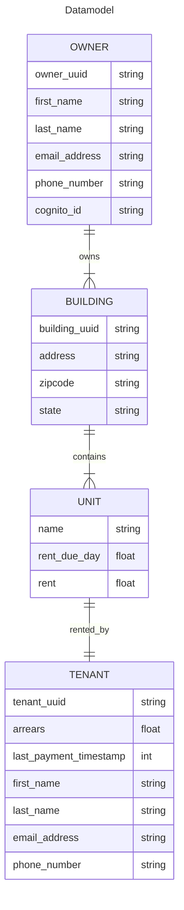

```mermaid
---
title: Datamodel
---

erDiagram
    OWNER ||--1+ BUILDING: owns
    OWNER {
        owner_uuid string
        first_name string
        last_name string
        email_address string
        phone_number string
        cognito_id string
    }
    BUILDING 1--1+ UNIT: contains
    BUILDING {
        building_uuid string
        address string
        zipcode string
        state string
    }
    UNIT 1--1 TENANT: rented_by
    UNIT {
        name string
        rent_due_day float
        rent float
    }
    TENANT {
        tenant_uuid string
        arrears float
        last_payment_timestamp int
        first_name string
        last_name string
        email_address string
        phone_number string
    }
```
